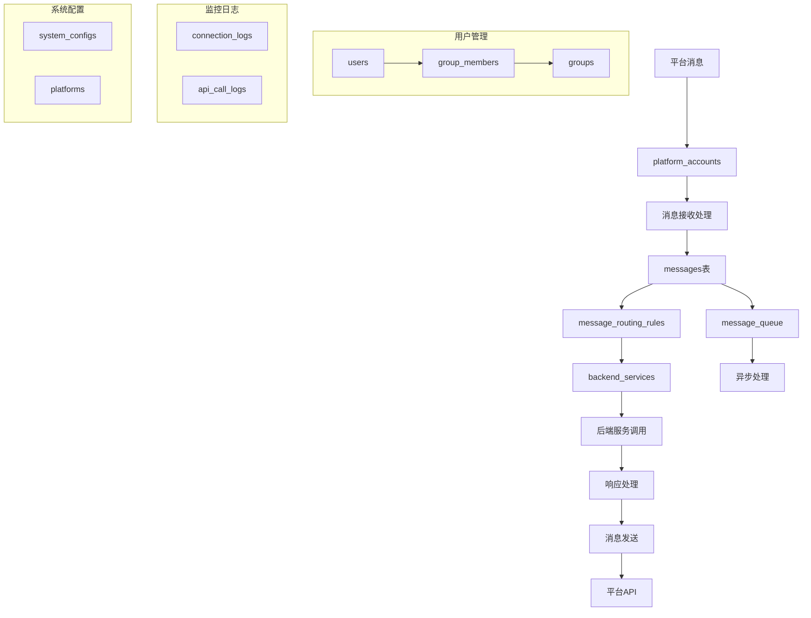

# OmniBotGo 数据库 ER 关系图

## 完整 ER 图

```mermaid
erDiagram
    platforms ||--o{ platform_accounts : "一对多"
    platforms ||--o{ users : "一对多"
    platforms ||--o{ groups : "一对多"
    platforms ||--o{ messages : "一对多"
    platforms ||--o{ connection_logs : "一对多"
    platforms ||--o{ api_call_logs : "一对多"
    
    platform_accounts ||--o{ users : "一对多"
    platform_accounts ||--o{ groups : "一对多"
    platform_accounts ||--o{ messages : "一对多"
    platform_accounts ||--o{ connection_logs : "一对多"
    platform_accounts ||--o{ api_call_logs : "一对多"
    
    users ||--o{ groups : "群主关系"
    users ||--o{ group_members : "一对多"
    users ||--o{ messages : "发送者"
    users ||--o{ messages : "接收者"
    
    groups ||--o{ group_members : "一对多"
    groups ||--o{ messages : "发送群组"
    groups ||--o{ messages : "接收群组"
    
    messages ||--o{ messages : "回复关系"
    
    backend_services ||--o{ message_routing_rules : "一对多"
    backend_services ||--o{ api_call_logs : "一对多"
    
    platforms {
        bigint id PK
        varchar platform_type
        varchar platform_name
        varchar platform_code UK
        varchar webhook_endpoint
        varchar api_base_url
        json rate_limit_config
        tinyint status
        timestamp created_at
        timestamp updated_at
    }
    
    platform_accounts {
        bigint id PK
        bigint platform_id FK
        varchar account_name
        varchar account_id
        varchar app_id
        varchar app_secret
        varchar corp_id
        varchar agent_id
        varchar webhook_token
        varchar webhook_secret
        varchar access_token
        timestamp access_token_expires_at
        varchar refresh_token
        varchar encryption_key
        json custom_config
        tinyint connection_status
        timestamp last_connected_at
        tinyint status
        timestamp created_at
        timestamp updated_at
    }
    
    users {
        bigint id PK
        bigint platform_id FK
        bigint account_id FK
        varchar platform_user_id
        varchar username
        varchar nickname
        varchar avatar_url
        varchar email
        varchar phone
        varchar department
        varchar position
        tinyint user_type
        json extra_info
        timestamp first_seen_at
        timestamp last_active_at
        tinyint status
        timestamp created_at
        timestamp updated_at
    }
    
    groups {
        bigint id PK
        bigint platform_id FK
        bigint account_id FK
        varchar platform_group_id
        varchar group_name
        tinyint group_type
        bigint owner_user_id FK
        int member_count
        text description
        varchar avatar_url
        json extra_info
        timestamp created_at
        timestamp updated_at
    }
    
    group_members {
        bigint id PK
        bigint group_id FK
        bigint user_id FK
        tinyint member_type
        timestamp join_time
        timestamp leave_time
        tinyint status
    }
    
    messages {
        bigint id PK
        varchar message_id UK
        bigint platform_id FK
        bigint account_id FK
        varchar platform_message_id
        tinyint direction
        varchar message_type
        varchar content_type
        tinyint sender_type
        bigint sender_user_id FK
        bigint sender_group_id FK
        tinyint receiver_type
        bigint receiver_user_id FK
        bigint receiver_group_id FK
        text content
        json raw_content
        json unified_content
        varchar media_url
        varchar media_type
        bigint file_size
        tinyint message_status
        int retry_count
        text error_message
        bigint parent_message_id FK
        varchar thread_id
        varchar backend_request_id
        timestamp platform_timestamp
        timestamp received_at
        timestamp processed_at
        timestamp sent_at
        timestamp created_at
        timestamp updated_at
    }
    
    backend_services {
        bigint id PK
        varchar service_name
        varchar service_type
        varchar endpoint_url
        varchar method
        int timeout_seconds
        varchar auth_type
        json auth_config
        json headers
        varchar request_format
        varchar response_format
        tinyint retry_enabled
        int max_retries
        int retry_backoff_seconds
        int priority
        tinyint status
        timestamp created_at
        timestamp updated_at
    }
    
    message_routing_rules {
        bigint id PK
        varchar rule_name
        text rule_description
        json platform_ids
        json account_ids
        json message_types
        json sender_patterns
        json content_patterns
        bigint backend_service_id FK
        tinyint route_type
        int priority
        tinyint is_fallback
        varchar condition_logic
        tinyint status
        timestamp created_at
        timestamp updated_at
    }
    
    system_configs {
        bigint id PK
        varchar config_key UK
        text config_value
        varchar config_type
        varchar config_group
        text description
        tinyint is_encrypted
        tinyint is_system
        timestamp created_at
        timestamp updated_at
    }
    
    connection_logs {
        bigint id PK
        bigint platform_id FK
        bigint account_id FK
        varchar event_type
        tinyint status
        varchar error_code
        text error_message
        json details
        timestamp created_at
    }
    
    api_call_logs {
        bigint id PK
        varchar request_id
        bigint platform_id FK
        bigint account_id FK
        bigint backend_service_id FK
        varchar method
        varchar url
        json request_headers
        text request_body
        int response_status
        json response_headers
        text response_body
        timestamp start_time
        timestamp end_time
        int duration_ms
        tinyint success
        text error_message
        timestamp created_at
    }
    
    message_queue {
        bigint id PK
        varchar queue_name
        varchar message_id
        json payload
        int priority
        int max_retries
        int retry_count
        tinyint status
        timestamp scheduled_at
        timestamp started_at
        timestamp completed_at
        text error_message
        timestamp created_at
        timestamp updated_at
    }
```

## 核心数据流图

## 表关系分类

### 1. 核心业务表
- `platforms` - 平台定义
- `platform_accounts` - 账号配置
- `messages` - 消息中心
- `users` - 用户管理
- `groups` - 群组管理

### 2. 配置管理表
- `system_configs` - 系统配置
- `backend_services` - 后端服务
- `message_routing_rules` - 路由规则

### 3. 关系维护表
- `group_members` - 群组成员关系

### 4. 队列处理表
- `message_queue` - 消息队列

### 5. 监控日志表
- `connection_logs` - 连接日志
- `api_call_logs` - API调用日志

## 数据库约束说明

### 主键约束
- 所有表使用 `BIGINT AUTO_INCREMENT` 主键
- 确保唯一性和高性能

### 外键约束
- 维护数据完整性
- 级联删除策略需要谨慎设计

### 唯一约束
- `platforms.platform_code` - 平台编码唯一
- `platform_accounts` - 平台内账号唯一
- `users` - 平台内用户唯一
- `groups` - 平台内群组唯一
- `messages.message_id` - 消息ID全局唯一

### 索引策略
- 高频查询字段建立复合索引
- 外键字段自动建立索引
- 时间字段建立索引支持时间范围查询
- JSON字段可使用虚拟列索引（MySQL 5.7+）
</rewritten_file> 