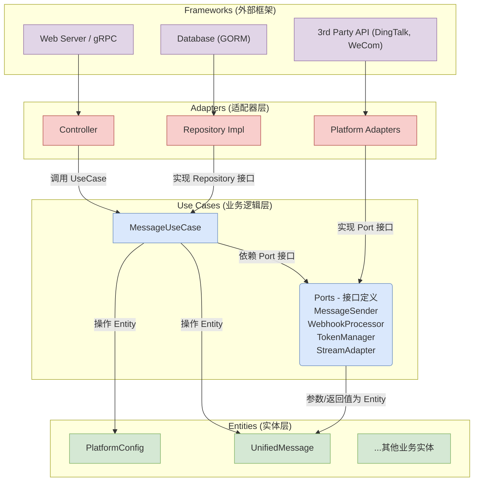

# 2. 技术架构文档 (Technical Architecture)

本文档描述了 OmniBotGo 项目重构后的技术架构。新架构严格遵循**整洁架构 (Clean Architecture)** 原则，并对接口设计和依赖关系进行了优化。

## 2.1. 核心原则

*   **分层与隔离**: 架构严格分为四个核心层次：`Entity`, `UseCase`, `Adapter`, `Frameworks`。
*   **依赖倒置**: 所有依赖关系都指向内部。`Adapter` 层依赖 `UseCase` 层，而不是相反。
*   **接口所有权**: 所有核心业务接口（端口）由 `UseCase` 层定义，并由 `Adapter` 层实现。

## 2.2. 架构图



### 依赖关系解读

1.  **中心是 UseCase 和 Entity**: 业务逻辑 (`UseCase`) 和业务实体 (`Entity`) 位于架构的核心，不依赖任何外部层次。
2.  **依赖箭头指向内部**:
    *   `Controller` 依赖 `UseCase`。
    *   `Repository` 实现依赖 `UseCase` (因为它实现了 `UseCase` 定义的接口)。
    *   `Platform Adapters` 依赖 `UseCase` (因为它实现了 `UseCase` 定义在 `port` 中的接口)。
3.  **接口所有权在 UseCase**: `port` 作为 `UseCase` 的一部分，定义了业务逻辑需要的所有"端口"或"能力"，如"发送消息的能力"。`Adapter` 层负责提供这些能力的具体实现，完全实现了控制反转 (IoC)。

## 2.3. 目录结构

重构后的核心目录结构如下：

```
internal/
├── app/                  # 应用启动、依赖注入 (Wire)
│   ├── wire.go
│   └── wire_gen.go
├── controller/           # 控制器层 (Web/gRPC)
├── usecase/              # 业务逻辑层
│   ├── message.go        # 消息处理核心逻辑
│   └── port/             # UseCase的端口/接口定义
│       └── platform.go
├── adapter/              # 适配器实现层
│   ├── manager.go        # 平台适配器管理器
│   ├── wecom/
│   ├── feishu/
│   └── dingtalk_stream/
├── entity/               # 业务实体和领域模型 (POCOs)
├── repo/                 # 数据仓库实现 (GORM)
└── service/              # 基础设施服务 (如 ConnectionManager)
```

## 2.4. 核心组件职责

*   **`entity`**: 只包含纯粹的业务数据结构和领域模型，没有任何接口定义或行为。
*   **`usecase/port`**: **架构的枢纽**。定义了业务逻辑所需的所有能力接口，是 `UseCase` 和 `Adapter` 之间解耦的关键。
*   **`usecase`**: 实现核心业务流程，它不知道也不关心是钉钉还是企业微信在发送消息，只知道调用 `port.MessageSender` 接口。
*   **`adapter`**: 提供与外部世界对话的具体实现。例如，`dingtalk_stream` 适配器会实现 `port.MessageSender` 和 `port.StreamAdapter` 接口。
*   **`controller`**: 将外部请求（如HTTP）转换为对 `UseCase` 的调用。
*   **`repo`**: 将领域对象持久化到数据库。
*   **`service/ConnectionManager`**: 一个特殊的基础设施服务，负责管理所有实现了 `port.StreamAdapter` 接口的适配器的生命周期。

通过本次重构，技术架构将更加清晰、健壮，并且极易于测试和未来的功能扩展。 