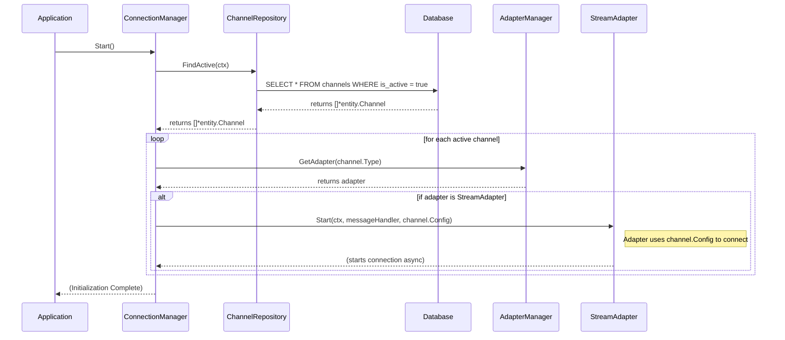

# 3. 功能架构文档 (Functional Architecture)

本文档从功能模块和流程的角度，描述 OmniBotGo 重构后的工作模式，重点阐述如何实现"单一实例同时管理和中ge多个平台消息"的核心目标。

## 3.1. 核心功能组件

新架构引入了 `ConnectionManager`，形成了与 `AdapterManager` 和 `WebServer` 互补的核心功能布局。

*   **`AdapterManager` (适配器管理器)**
    *   **职责**: 负责**注册**和**提供**所有平台适配器的实例。它是所有适配器的"工厂"和"目录"。
    *   **能力**: 能根据平台类型 (`PlatformType`) 获取对应的适配器。

*   **`WebServer` (Web服务器)**
    *   **职责**: 负责处理所有**被动模式 (Passive/Webhook)** 平台的通信。
    *   **流程**: 监听HTTP请求 -> 将请求转发给对应的 `Controller` -> `Controller` 调用 `UseCase`。

*   **`ConnectionManager` (连接管理器)** - **新增核心组件**
    *   **职责**: 负责所有**主动模式 (Active/Stream)** 平台连接的**生命周期管理**。其配置完全由数据库驱动。
    *   **流程**:
        1.  **启动时**: 通过 `ChannelRepository` 从数据库加载所有标记为"活跃"的通道 (`Channel`)。对于每个通道，它会通过 `AdapterManager` 获取对应的适配器，并调用其 `Start()` 方法来建立长连接，同时将通道的配置信息传递给适配器。
        2.  **关闭时**: 负责调用所有已启动连接的 `Stop()` 方法，实现优雅停机。

## 3.2. 系统启动与连接管理流程

修正后的架构强调**数据库作为唯一配置源**，彻底分离了应用配置和业务通道配置。

### 消息处理流程

#### 入站消息 (Inbound)

*   **主动模式 (如钉钉Stream)**
    1.  钉钉服务器通过已建立的 WebSocket 长连接推送消息。
    2.  `dingtalk_stream` 的 `StreamController` 接收到原始消息。
    3.  `StreamController` 将消息转换为统一的 `entity.Message`，并附带上它所属的平台实例名称 (Platform Name)。
    4.  `StreamController` 调用注入的 `MessageUseCase` 来处理消息。

*   **被动模式 (如企业微信Webhook)**
    1.  企业微信服务器向 `WebServer` 暴露的 Webhook URL 发送一个HTTP POST请求。
    2.  `WebServer` 将请求路由到 `wecom` 的 `Controller`。
    3.  `Controller` 调用 `wecom` 适配器的方法，将HTTP请求体转换为统一的 `entity.Message`。
    4.  `Controller` 调用 `MessageUseCase` 的处理方法。

#### 出站消息 (Outbound)

出站流程是统一的：

1.  任何服务调用 `MessageUseCase` 的 `SendMessage` 方法。
2.  `MessageUseCase` 根据消息中的 `PlatformType`，向 `AdapterManager` 请求一个具备 `MessageSender` 能力的适配器。
3.  `MessageUseCase` 调用该适配器的 `SendMessage` 方法。
4.  适配器负责将统一消息 `entity.Message` 转换为特定平台的格式，并通过API或 `sessionWebhook` 发送出去。

## 3.3. 总结

通过引入 `ConnectionManager` 并明确各组件职责，新功能架构实现了：

*   **统一管理**: `ConnectionManager` 和 `WebServer` 分别管理主动和被动两种模式，职责清晰。
*   **数据库驱动配置**: 系统的连接行为完全由数据库中的 `channels` 表定义，实现了动态、持久化的配置管理，移除了对静态配置文件的依赖。
*   **高可扩展性**: 接入新平台时，只需开发对应的适配器并实现相应的 `port` 接口，然后在数据库中添加一条 `channel` 记录即可，对现有系统无任何侵入。

这套功能架构完全能够满足项目预设的"高性能、可扩展的统一消息适配器网关"的目标。 