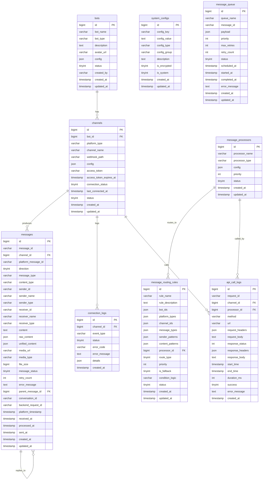

# OmniBotGo 数据库 ER 图

## 📊 实体关系图

## 🔗 关系说明

### 核心关系
- **Bot → Channels**: 一个Bot可以配置多个平台通道（1:N）
- **Channels → Messages**: 一个通道产生多条消息（1:N）
- **Messages → Messages**: 消息可以回复其他消息（自关联）

### 路由关系
- **Message Processors → Routing Rules**: 一个消息处理器可以被多个路由规则使用（1:N）
- **Routing Rules**: 通过JSON字段匹配Bot、平台、通道等条件

### 日志关系
- **Channels → Connection Logs**: 记录通道连接状态变化（1:N）
- **Channels/Processors → API Call Logs**: 记录API调用详情（N:1）

## 📋 表类型分类

### 🤖 Bot管理层
- `bots` - Bot实例管理

### 🔌 连接层  
- `channels` - 平台通道配置

### 💬 消息层
- `messages` - 统一消息存储
- `message_queue` - 消息队列

### 🚀 处理层
- `message_processors` - 消息处理器配置
- `message_routing_rules` - 路由规则

### ⚙️ 系统层
- `system_configs` - 系统配置

### 📊 监控层
- `connection_logs` - 连接日志
- `api_call_logs` - API调用日志

## 🎯 架构特点

### 1. **层次清晰**
Bot实例 → 平台通道 → 消息流 → 消息处理器，每层职责明确

### 2. **Bot中心化**
所有资源围绕Bot实例组织，支持多Bot场景独立管理

### 3. **代码驱动**
平台适配器和处理器类型在代码中定义，数据库只存储实例配置

### 4. **智能路由**
基于多维度条件的消息路由，支持复杂业务场景

### 5. **监控完善**
连接状态、API调用、消息流转全程记录，支持问题诊断和性能优化

### 6. **扩展友好**
- 新增平台只需代码适配，无需数据库迁移
- JSON配置灵活适应不同平台需求
- 插件化的处理器架构 